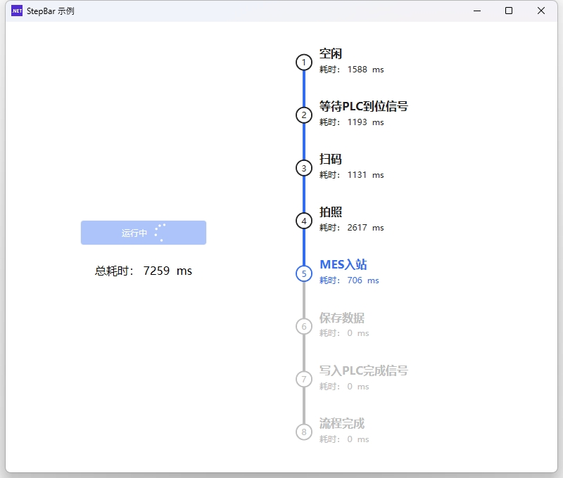

# StepBar.Demo

这是一个基于 WPF 的示例项目，演示了如何结合 `HandyControl` 和 `ReactiveUI` 来实现一个带有进度指示（StepBar）的任务流程模拟应用。

本项目展示了在 .NET 10 环境下，如何使用 MVVM 模式管理异步任务流程，并实时更新 UI 上的步骤状态和耗时信息。

## ✨ 特性

- **现代化 UI**: 使用 [HandyControl](https://github.com/HandyOrg/HandyControl) 的 `StepBar` 控件展示流程进度。
- **MVVM 架构**: 基于 [ReactiveUI](https://www.reactiveui.net/) 实现响应式属性绑定和命令处理。
- **异步任务模拟**: 模拟工业场景下的顺序任务（如 PLC 信号等待、扫码、拍照等）。
- **实时计时**: 实时显示每个步骤的执行耗时以及总耗时。

## 📸 截图



## 🛠 技术栈

- **.NET 10.0** (Preview)
- **WPF** (Windows Presentation Foundation)
- **HandyControl** (UI 控件库)
- **ReactiveUI** (MVVM 框架)

## 🚀 快速开始

### 前置要求

- Visual Studio 2026 (或支持 .NET 10 的 IDE)
- .NET 10.0 SDK

### 获取代码

```bash
git clone https://github.com/yourusername/StepBar.Demo.git
cd StepBar.Demo
```

### 安装依赖

本项目使用 NuGet 管理依赖。在项目根目录下运行以下命令还原包：

```bash
dotnet restore
```

### 运行项目

使用 Visual Studio 打开 `StepBar.Demo.slnx` 解决方案文件并按 `F5` 运行，或者在命令行中使用：

```bash
dotnet run --project StepBar.Demo/StepBar.Demo.csproj
```

## 📖 基本使用

1. 启动应用程序后，你会看到左侧的操作面板和右侧的步骤条。
2. 点击左侧的 **"运行"** 按钮开始模拟流程。
3. 程序将按顺序执行预定义的步骤（如“等待PLC到位信号”、“扫码”等）。
4. 每个步骤在执行时会模拟随机延迟（1-3秒），界面会实时更新当前步骤的状态和耗时。
5. 流程结束后，可以在左侧看到总耗时统计。

## 📂 目录结构

```text
StepBar.Demo/
├── StepBar.Demo/              # 主项目文件夹
│   ├── App.xaml               # 应用程序入口
│   ├── MainWindow.xaml        # 主窗口 UI 定义 (包含 StepBar)
│   ├── MainWindow.xaml.cs     # 主窗口代码隐藏文件
│   ├── MainWindowViewModel.cs # 主窗口 ViewModel (业务逻辑)
│   ├── StepDefinition.cs      # 步骤定义模型 (名称, 工作负载)
│   ├── StepProgress.cs        # 步骤进度模型 (计时, 状态)
│   └── StepBar.Demo.csproj    # 项目文件
├── StepBar.Demo.slnx          # 解决方案文件
└── README.md                  # 项目说明文档
```

## 🤝 贡献方式

欢迎提交 Issue 或 Pull Request 来改进此项目！

1. Fork 本仓库
2. 创建你的特性分支 (`git checkout -b feature/AmazingFeature`)
3. 提交你的修改 (`git commit -m 'Add some AmazingFeature'`)
4. 推送到分支 (`git push origin feature/AmazingFeature`)
5. 开启一个 Pull Request

## 📄 许可证

本项目基于 [MIT 许可证](LICENSE) 开源。

---
*注意：本项目依赖 .NET 10 ，请确保开发环境已正确配置。*
